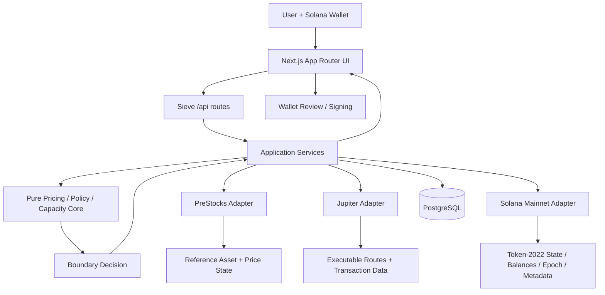

# Sieve

**You set the boundary. Sieve enforces it.**

Sieve is a Mainnet-only execution-boundary engine for PreStocks on Solana. It lets a user choose an asset, side, amount, and execution boundary, then checks live executable liquidity before a transaction is prepared.

Sieve does not decide what a user should buy or sell. The user defines the policy; Sieve verifies whether the current route fits that policy and enforces the result.

**Live app:** https://usesieve.vercel.app

<p align="left">
  
  
  
  
  
  
  
  
  
</p>

## Videos

| Pitch | Technical walkthrough |
| --- | --- |
| [](https://youtu.be/ElVEez1zC8E) | [](https://youtu.be/IxfPqoYxHp8) |
| [Watch pitch video](https://youtu.be/ElVEez1zC8E) | [Watch technical video](https://youtu.be/IxfPqoYxHp8) |

**Full product demo on X:** https://x.com/Habuskiid/status/2103226163833290816?s=20

---

## Table of Contents

- [Videos](#videos)
- [Problem](#problem)
- [What Sieve Does](#what-sieve-does)
- [Core Use Cases](#core-use-cases)
- [Execution Model](#execution-model)
  - [Buy Boundary](#buy-boundary)
  - [Sell Boundary](#sell-boundary)
  - [Boundary Capacity](#boundary-capacity)
- [How It Works](#how-it-works)
- [Architecture](#architecture)
- [System Responsibilities](#system-responsibilities)
- [Product Surfaces](#product-surfaces)
- [API Surface](#api-surface)
- [Persistence Model](#persistence-model)
- [Tech Stack](#tech-stack)
- [Project Structure](#project-structure)
- [Mainnet and Token Semantics](#mainnet-and-token-semantics)
- [Security and Reliability](#security-and-reliability)
- [Local Development](#local-development)
- [Environment Variables](#environment-variables)
- [Database Migrations](#database-migrations)
- [Supabase Free Project Keepalive](#supabase-free-project-keepalive)
- [Testing](#testing)
- [Design Principles](#design-principles)
- [Non-Goals](#non-goals)

---

## Problem

A quoted market route can move away from a reference valuation before a user signs.

For tokenized private-market assets, the difference between a reference price and the executable market price can be meaningful. A dashboard can show that difference, but showing information is not the same as enforcing a user's decision.

A user may decide:

- "I will buy only if the effective price is no more than 5% above the reference price."
- "I will sell only if the effective price is no more than 4% below the reference price."
- "I want to know how much of this order can currently execute without crossing the boundary I supplied."

Without an enforcement layer, the user still has to manually compare the reference value, live route, token conversion state, fees, and final transaction parameters.

Sieve turns that decision into an execution rule.

---

## What Sieve Does

Sieve sits between user intent and transaction preparation.

The user provides:

- target PreStock
- side: Buy or Sell
- requested amount
- execution boundary
  - maximum premium for Buy
  - maximum discount for Sell

Sieve then:

1. gets the current PreStocks reference state
2. gets executable liquidity from Jupiter
3. reads authoritative Solana Mainnet token state
4. accounts for token decimals, Token-2022 ScaledUi conversion, and transfer-fee behavior where applicable
5. calculates the effective execution price
6. evaluates the user's boundary
7. blocks transaction preparation when the boundary is exceeded
8. revalidates the important state again before building the transaction
9. records checks and execution outcomes in PostgreSQL-backed history

A boundary check and an execution are deliberately different lifecycle stages. A check can exist without a transaction ever being prepared.

---

## Core Use Cases

### 1. Buy a PreStock without exceeding a maximum premium

A user can fund a Buy with **USDC or SOL**, choose a maximum acceptable premium above the current PreStocks reference price, and let Sieve enforce that ceiling before wallet review.

### 2. Sell a PreStock without exceeding a maximum discount

A user can sell a PreStock into **canonical Solana USDC** and define the maximum discount they are willing to accept relative to the current reference price.

### 3. Measure Boundary Capacity

If the full requested amount does not fit the user's boundary, Sieve can search for the largest **actually observed** amount from that requested order that currently passes the same boundary within a strict quote-probe budget.

### 4. Review an execution audit trail

The History view combines Buy and Sell checks and executions into one wallet-scoped timeline with:

- side
- asset
- amount
- effective execution price
- boundary
- timestamp
- transaction state

---

## Execution Model

### Buy Boundary

For a Buy, the user defines a maximum premium above the current reference price.

```text
maximum_buy_price
  = reference_price × (1 + max_premium)

current_buy_price
  = verified_funding_usd_value
    / expected_net_economic_prestock_received
```

The Buy is inside the boundary only when:

```text
current_buy_price <= maximum_buy_price
```

The denominator is the expected **net economic PreStock amount**, not a naive raw-token quantity.

Sieve derives transaction protection so the built transaction does not silently weaken the user's price boundary.

### Sell Boundary

For a Sell, the user defines a maximum discount below the current reference price.

```text
minimum_sell_price
  = reference_price × (1 - max_discount)

current_sell_price
  = guaranteed_net_usdc_received
    / economic_prestock_units_sold
```

The Sell is inside the boundary only when:

```text
current_sell_price >= minimum_sell_price
```

Sell settlement is to canonical Solana USDC.

### Boundary Capacity

Boundary Capacity answers:

> How much of this requested order is currently executable without crossing the boundary you supplied?

The implementation is intentionally bounded and evidence-based:

- probes the full requested amount first
- uses a hard maximum of 10 quote probes
- uses integer `bigint` amounts
- every verified candidate must actually be quoted and evaluated
- returns the highest observed passing candidate
- does not interpolate an unobserved amount
- does not rely on route monotonicity for correctness
- does not claim to discover global maximum liquidity

If no observed candidate passes, Sieve returns no verified capacity.

Boundary Capacity is an execution-boundary measurement, not a recommended order size.

---

## How It Works

A normal execution lifecycle looks like this:

1. **Connect wallet**  
   Wallet connection opens the application workspace. Sieve does not use email/password authentication.

2. **Choose execution intent**  
   Select a PreStock, Buy or Sell, amount, and boundary.

3. **Check the route**  
   Sieve combines PreStocks reference state, Jupiter route data, and Solana token state.

4. **Evaluate the boundary**  
   The pure policy layer calculates the effective execution price and returns an objective result such as **Within boundary** or **Boundary exceeded**.

5. **Measure capacity when needed**  
   Boundary Capacity can search a bounded set of live quote sizes when the requested order needs partial-size evaluation.

6. **Prepare transaction**  
   Build services revalidate the relevant state before returning a transaction for wallet review.

7. **Wallet review and signing**  
   The user remains the signing authority.

8. **Confirm and persist outcome**  
   Confirmation services reconcile the execution result and persist the lifecycle record.

9. **Audit in History**  
   Buy and Sell checks and executions are merged into one wallet- and network-scoped timeline.

---

## Architecture



The codebase is intentionally split into layers:

### UI layer

Next.js pages and React components render the user workflow and call Sieve's own API routes.

### API layer

Next.js route handlers validate requests, apply request-level controls, and delegate to services.

### Service layer

Services orchestrate:

- market/reference retrieval
- Solana state reads
- Jupiter quoting/building
- boundary evaluation
- revalidation
- persistence
- confirmation
- history aggregation

### Core domain layer

The `core/` directory contains deterministic execution logic such as:

- money conversion
- pricing
- Buy/Sell boundary evaluation
- freshness rules
- slippage/protection derivation
- Boundary Capacity search

This layer is kept separate from external providers so the core invariants are directly testable.

### Adapter layer

External systems are isolated behind server-side adapters:

- PreStocks
- Jupiter
- Solana RPC
- PostgreSQL

---

## System Responsibilities

| Component | Responsibility |
| --- | --- |
| **User** | Chooses asset, side, amount, and boundary |
| **Sieve** | Verifies and enforces the supplied execution boundary |
| **PreStocks** | Supplies asset identity and reference valuation state |
| **Jupiter** | Supplies executable route/liquidity and transaction data |
| **Solana Mainnet** | Supplies authoritative token state, balances, metadata, epoch/time, and Token-2022 state |
| **PostgreSQL** | Persists checks, build intents, receipts, and history |

Sieve does not replace the reference source, liquidity provider, blockchain, or wallet. It coordinates those systems around a user-defined execution rule.

---

## Product Surfaces

| Route | Purpose |
| --- | --- |
| `/` | Landing page |
| `/dashboard` | Primary Buy/Sell execution workspace |
| `/markets` | PreStocks market/reference view |
| `/history` | Unified Buy/Sell execution and boundary-check history |
| `/preferences` | User-facing application preferences |
| `/buy` | Legacy compatibility route that redirects to `/dashboard` while preserving query parameters |

The main navigation is:

`Dashboard → Markets → History → Preferences`

An explicit wallet disconnect returns the user to the landing page.

---

## API Surface

### Buy lifecycle

| Method | Endpoint | Purpose |
| --- | --- | --- |
| POST | `/api/check` | Evaluate a Buy against the user's maximum-premium boundary |
| POST | `/api/build` | Revalidate and prepare the Buy transaction |
| POST | `/api/confirm` | Confirm/reconcile the Buy execution |

### Sell lifecycle

| Method | Endpoint | Purpose |
| --- | --- | --- |
| POST | `/api/sell/check` | Evaluate a Sell against the user's maximum-discount boundary |
| POST | `/api/sell/build` | Revalidate and prepare the Sell transaction |
| POST | `/api/sell/confirm` | Confirm/reconcile the Sell execution |

### Capacity, market data, and history

| Method | Endpoint | Purpose |
| --- | --- | --- |
| POST | `/api/capacity/buy` | Measure Buy Boundary Capacity |
| POST | `/api/capacity/sell` | Measure Sell Boundary Capacity |
| GET | `/api/markets` | Return the current PreStocks market/reference view |
| GET | `/api/history` | Return wallet-scoped unified Buy/Sell history |

External provider credentials stay server-side. The browser talks to Sieve's own API routes rather than receiving provider secrets.

---

## Persistence Model

Sieve uses PostgreSQL through `postgres.js`.

Current persisted lifecycle tables include:

| Table | Purpose |
| --- | --- |
| `price_checks` | Buy boundary-check snapshots |
| `build_intents` | Buy transaction-build intents |
| `trade_receipts` | Buy execution receipts |
| `sell_price_checks` | Sell boundary-check snapshots |
| `sell_build_intents` | Sell transaction-build intents |
| `sell_trade_receipts` | Sell execution receipts |
| `schema_migrations` | Applied migration tracking |

History merges Buy and Sell checks/receipts server-side, removes duplicate lifecycle representation when a receipt already represents its originating check, sorts globally by persisted time, and scopes reads to the connected wallet and Mainnet network.

---

## Tech Stack

### Application

- **Next.js 15** - App Router, pages, and API routes
- **React 19**
- **TypeScript**
- **Tailwind CSS**
- **Framer Motion**
- **Lucide React**

### Solana

- **@solana/web3.js**
- **@solana/spl-token**
- **Solana Wallet Adapter**
- **Solana Mainnet RPC**
- **Token-2022-aware conversion/accounting**

### Market and execution integrations

- **PreStocks API**
- **Jupiter APIs**

### Data and correctness

- **PostgreSQL**
- **postgres.js**
- **Decimal.js**
- **Zod**

#
## Supabase Free Project Keepalive

This repository includes a scheduled GitHub Actions workflow at `.github/workflows/supabase-keepalive.yml`.

The workflow sends a small read-only request to Sieve's live `/api/history` route every day. That route performs wallet- and network-scoped PostgreSQL reads, which creates real database activity without inserting, updating, or deleting application data.

The keepalive is intentionally more frequent than once every seven days because Supabase evaluates activity over a rolling weekly window. A single request exactly once per week is not treated as a guaranteed anti-pause mechanism.

The workflow can also be run manually from the GitHub Actions tab.

## Testing

- **Vitest**
- **Testing Library**
- **Playwright**

---

## Project Structure

```text
sieve/
├── app/
│   ├── api/                 # Next.js API routes
│   ├── dashboard/           # Primary execution workspace
│   ├── markets/
│   ├── history/
│   └── preferences/
├── components/              # React UI and product components
├── core/
│   ├── capacity/            # Bounded Boundary Capacity search
│   ├── domain/              # Shared execution-domain types
│   ├── freshness/           # Reference/quote freshness rules
│   ├── money/               # Decimal/raw/economic conversions
│   ├── policy/              # Buy/Sell boundary evaluator
│   ├── pricing/             # Effective-price calculations
│   └── protection/          # Transaction output/slippage protection
├── server/
│   ├── database/            # PostgreSQL + repository implementations
│   ├── jupiter/             # Jupiter adapter and schemas
│   ├── prestocks/           # PreStocks adapter and schemas
│   ├── solana/              # Mainnet RPC / Token-2022 state adapter
│   ├── middleware/          # Server request controls
│   ├── security/            # Security helpers
│   └── services/            # Check/build/confirm/capacity/history orchestration
├── db/
│   └── migrations/          # Ordered SQL migrations
├── scripts/                 # Migration and diagnostic scripts
├── tests/
│   ├── unit/
│   ├── integration/
│   └── e2e/
└── public/
```

---

## Mainnet and Token Semantics

Sieve is intentionally **Solana Mainnet only**.

There is no user-selectable Testnet, Devnet, or simulated production mode.

Automated tests may inject deterministic adapters and fixtures, but those are test-only dependencies and are not exposed through production application routes.

Important execution details include:

- PreStock token decimals are read from authoritative chain state
- Token-2022 ScaledUi multipliers are applied when converting raw amounts to economic amounts
- transfer-fee behavior is included where relevant
- Sell input accounting distinguishes wallet debit, transfer fee, and route input
- Buy output protection derives a minimum raw output compatible with the user's maximum price
- Sell output protection derives a minimum USDC output compatible with the user's minimum sell price
- stale or inconsistent execution state fails closed instead of silently weakening the boundary

Canonical Solana USDC is the settlement asset for Sell execution.

---

## Security and Reliability

Sieve is designed around explicit execution boundaries and fail-closed behavior.

Key properties include:

- external API credentials remain server-side
- request payloads are validated
- execution checks are wallet-bound
- checks and builds have freshness constraints
- important state is revalidated before transaction preparation
- transaction protection is derived from the user's boundary
- Mainnet token state is read from Solana rather than trusted from the browser
- history reads are scoped by wallet and network
- exact money calculations use decimal/integer-aware utilities rather than floating-point shortcuts
- the user's wallet remains the signing authority
- blocked checks do not need to become transactions

Never place private keys, seed phrases, or wallet secrets in Sieve environment variables.

---

## Local Development

### Prerequisites

- Node.js 20+
- pnpm
- PostgreSQL
- a Solana Mainnet RPC endpoint
- Jupiter API credentials where required

### Install

```bash
git clone https://github.com/Habuskid/sieve.git
cd sieve
pnpm install
```

Create `.env.local` from `.env.example` and provide the required server-side configuration.

Apply database migrations:

```bash
pnpm db:migrate
```

Start the application:

```bash
pnpm dev
```

Then open the local Next.js application in your browser.

---

## Environment Variables

The repository includes `.env.example`.

Primary configuration includes:

| Variable | Purpose |
| --- | --- |
| `APP_ENV` | Application environment |
| `NEXT_PUBLIC_APP_URL` | Public application origin |
| `PRESTOCKS_API_URL` | PreStocks API endpoint |
| `JUPITER_API_BASE` | Jupiter API base |
| `JUPITER_API_KEY` | Server-side Jupiter credential |
| `READONLY_TAKER_WALLET` | Public wallet used by read-only diagnostics/configuration |
| `SOLANA_MAINNET_RPC_URL` | Solana Mainnet RPC endpoint |
| `DATABASE_URL` | Runtime PostgreSQL connection |
| `MIGRATION_DATABASE_URL` | Migration-only PostgreSQL connection |

Do not expose private server credentials through `NEXT_PUBLIC_*` variables.

---

## Database Migrations

Migrations live in `db/migrations/` and are applied in filename order.

The migration runner:

- requires `MIGRATION_DATABASE_URL`
- tracks applied migrations in `schema_migrations`
- wraps each pending migration in a transaction
- does not fall back to the runtime `DATABASE_URL`

Run:

```bash
pnpm db:migrate
```

---

## Testing

Run TypeScript checks:

```bash
pnpm typecheck
```

Run lint:

```bash
pnpm lint
```

Run unit tests:

```bash
pnpm test
```

Run integration tests:

```bash
pnpm test:integration
```

Run the full non-browser test suite:

```bash
pnpm test:all
```

Run Playwright:

```bash
pnpm test:e2e
```

Run the explicit read-only Mainnet diagnostic suite:

```bash
pnpm test:live:readonly
```

The live read-only suite is for observation and compatibility checks. It is not a signing or fund-movement test.

---

## Design Principles

### User-defined policy

Sieve does not choose the asset, side, amount, or boundary. Those decisions belong to the user.

### Enforcement over recommendation

The product answers whether an executable route satisfies a supplied rule. It does not tell the user whether a trade is a good idea.

### Observable evidence over inferred liquidity

Boundary Capacity only trusts amounts that were actually quoted and evaluated.

### Server-authoritative integrations

Reference data, liquidity, token state, and persistence are handled through server-side integrations.

### Revalidation before preparation

Passing an earlier check is not treated as permanent permission to build. Relevant state is checked again before transaction preparation.

### Objective status language

The interface uses execution language such as:

- Within boundary
- Boundary exceeded
- Executable within boundary
- Checked
- Blocked
- Confirmed
- Failed

It avoids advisory language that could imply an investment recommendation.

---

## Non-Goals

Sieve is **not**:

- an investment adviser
- a fair-value oracle
- a price prediction system
- an autonomous trader
- a portfolio manager
- a system that chooses a user's risk tolerance
- a claim of best execution across every possible venue
- a guarantee of global maximum liquidity

It is an execution-constraint system for enforcing a boundary the user supplied against the state Sieve verifies at execution time.
